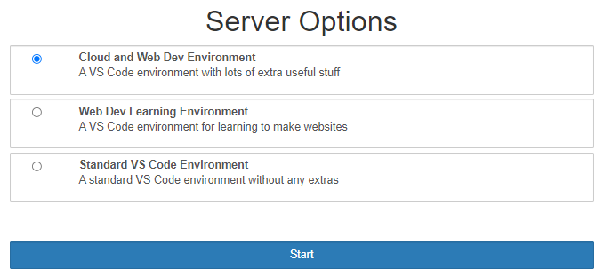
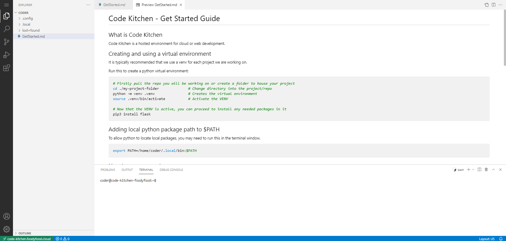
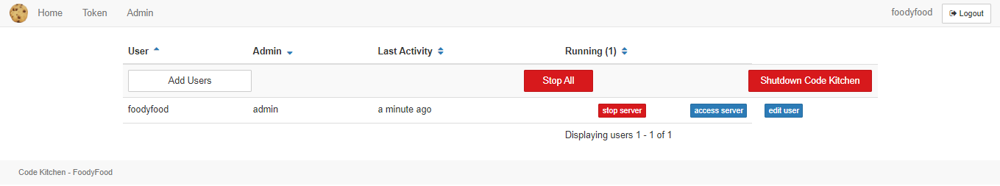

# Code Kitchen - Custom Codespaces

```bash
Maintained by: Daniel OConnor
```

### Description

Code Kitchen is an IDE you can host in your own kubernetes cluster. 

This is based off cdr/coder, and JupyterHub, which when combined give you managed VS Code containers.

The conntainers this repo builds are custom ones I use for myself and my friends.

This repository contains the deployment scripts and config.

<b>Dont forget to keep your config repo private, it likely contains secrets</b>


### Repositories In The Series

This series of repositories brings you from creating a cluster through to hsoting code-kitchen yourself as well as anything else you can dream of building in code-kitchen.

Make your own cluster: [personal-cluster](https://github.com/FoodyFood/personal-cluster) \
Configure the cluster: [personal-cluster-base-config](https://github.com/FoodyFood/personal-cluster-base-config) \
Build code-kitchen: [code-kitchen-build](https://github.com/FoodyFood/code-kitchen-build) \
Deploy code-kitchen to your cluster: [code-kitchen-deploy](https://github.com/FoodyFood/code-kitchen-deploy)


### Installing Code Kitchen

First we need to make it point to your builds and your GitHub account.

Take a look in jh-values.yaml and replace any if the <github-username> tags with your own.

```yaml
hub:
  image:
    name: "ghcr.io/<github-username>/code-kitchen-hub"
    tag:  "code-kitchen-hub-image-tag"
```

Further down you will need to use your own SSO source, I used Keycloak and also included my values for KeyCloak to get you started, but it will work with any.

```yaml
  config:
    GenericOAuthenticator:
      client_id: code-kitchen
      client_secret: <secret-goes-here>
      oauth_callback_url: https://code-kitchen-url/hub/oauth_callback
      authorize_url: https://sso.example.com/auth/realms/code-kitchen/protocol/openid-connect/auth
      token_url: https://sso.example.com/auth/realms/code-kitchen/protocol/openid-connect/token
      userdata_url: https://sso.example.com/auth/realms/code-kitchen/protocol/openid-connect/userinfo
```

Once those are configured, and your images are built using the previous repo in the series.

Proceed to deploying code-kitchen 

```bash
make deploy-code-kitchen
```

### The Choices
Currently there is only 1 image type to choose from



<br>

### The Workspace
An example of what a client will see when they are using Code Kitchen



<br>

### The Administration Panel
An administrator can be nominated that has extra powers, here is their admin panel



<br>
